 

 

## `$ whoami`

  

 

- 🛠️ &nbsp;I design and build **end-to-end web products**, from the database schema to the pixel.
- 🧩 &nbsp;Most days I'm deep in **Laravel + Filament** admin panels, CRMs and online shops.
- 🎨 &nbsp;I build **custom WordPress themes & plugins** for real businesses.
- ⚡ &nbsp;I reach for **Go** when a service needs to be small, fast and boring-in-a-good-way.
- 🤖 &nbsp;Currently exploring **AI-powered tools** and how to ship them to real users.

 

## `$ ls ~/stack`

  
   
  

 

## `$ git log --stat`

  

 

  <picture>
    <source media="(prefers-color-scheme: dark)" srcset="https://raw.githubusercontent.com/Epicaler/Epicaler/output/github-snake-dark.svg" />
    <source media="(prefers-color-scheme: light)" srcset="https://raw.githubusercontent.com/Epicaler/Epicaler/output/github-snake.svg" />
    
  </picture>

 

**Have a project in mind?** &nbsp;Let's build something great together.

